# Clinic Management System  

A **database-driven application** developed for the *Advanced Database* course.  
This project demonstrates how advanced database concepts can be applied in a real-world clinic scenario, focusing on:  
- Normalization and structured schema design  
- Indexing and query optimization for performance  
- Stored procedures and triggers for automation  
- Secure authentication and patient data management  

The result is a prototype system that manages core clinic operations such as patients, doctors, appointments, treatments, and billing.  

---

## 🚀 Features  

- **Authentication & Security**  
  - User registration, login, and OTP verification  
  - Role-based access (Admin, Doctor, Staff)  

- **Dashboard**  
  - Centralized overview of patients, doctors, and appointments  

- **Patient Management**  
  - Add, edit, and search patient records  
  - Track medical history  

- **Doctor Management**  
  - Maintain doctor profiles & schedules  
  - Review & feedback system  

- **Appointment Management**  
  - Book and manage appointments  
  - Appointment status tracking (pending, confirmed, completed)  

- **Reports & Analytics**  
  - Clinic activity reports & financial overview  
  - Extendable for future data exports  

- **User Experience (React + Vite)**  
  - Modular components (`Appointments`, `Doctors`, `Patients`, `Reports`, `Dashboard`)  
  - Context API for state management  
  - Styled with modular CSS for a clean, modern UI  

---

## 📦 Tech Stack  

- **Frontend:** React, Vite, Context API, CSS Modules  
- **Backend:** (API/Database integration – configurable)  
- **Other Tools:** Node.js, npm  

---

## 📸 Demo Flow  

Below is the system demo from the **end-user perspective**, illustrating how a clinic staff member interacts with the system step by step.  

### 1. Authentication & Access  
- **Login**  
  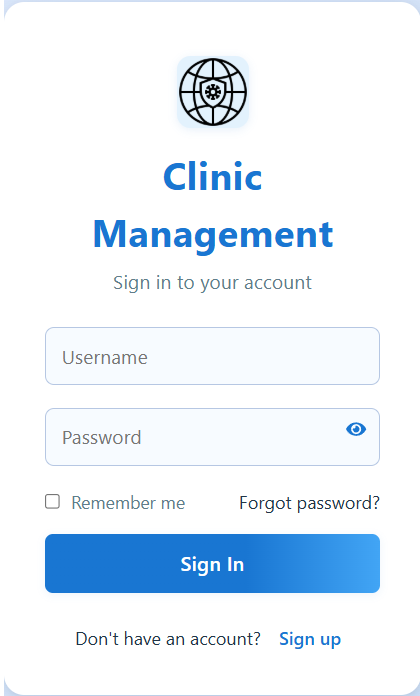  
- **OTP Verification**  
  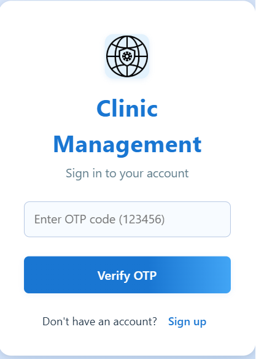  
- **Register a New Account**  
  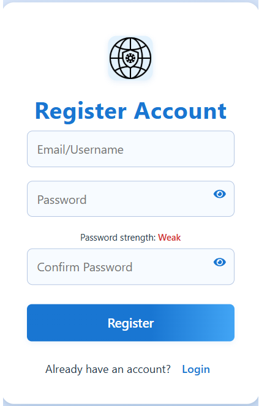  

---

### 2. Dashboard & Navigation  
- **Main Dashboard** – Centralized overview of patients, doctors, and appointments.  
  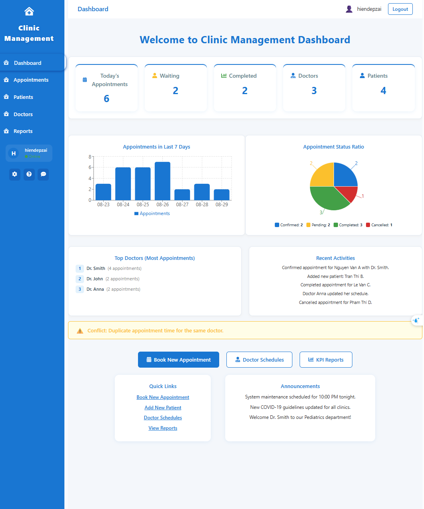  
- **Help & Settings** – Access user support and customize settings.  
  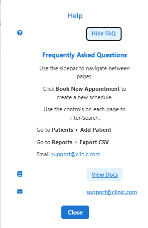  
  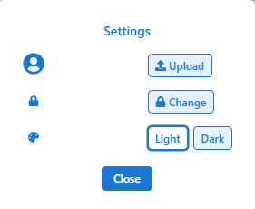  

---

### 3. Patient Management  
- **Add a New Patient**  
    
- **Edit Patient Information**  
    
- **View Patient Records**  
    
- **Patients List**  
  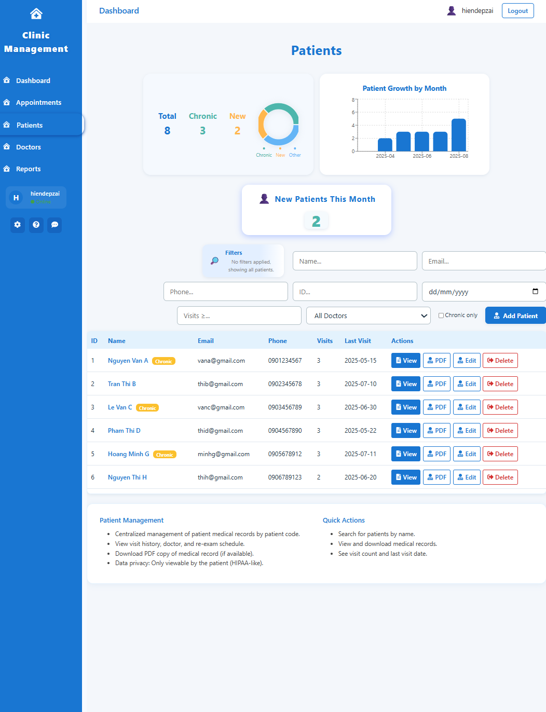  

---

### 4. Doctor Management  
- **Add a New Doctor**  
    
- **Edit Doctor Profile**  
    
- **View Doctors**  
  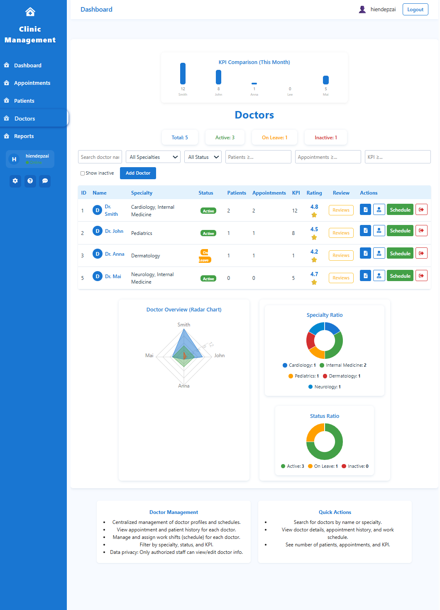  
- **Doctor Schedule Example (Dr. Anna)**  
    
- **Doctor Review**  
    

---

### 5. Appointment Management  
- **Appointments Overview**  
  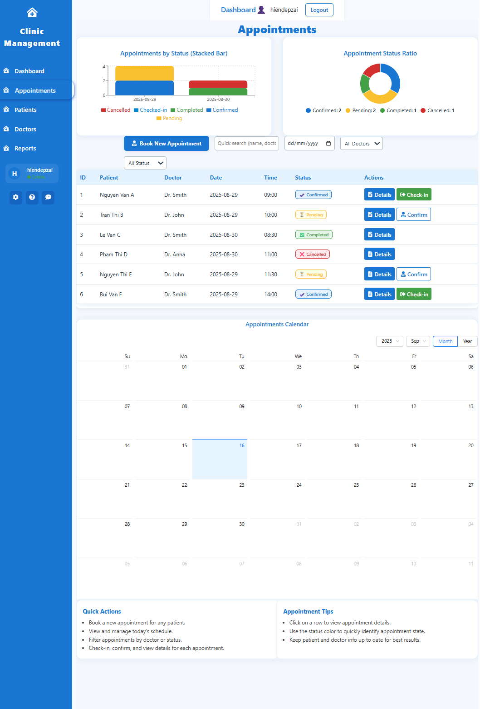  
- **Appointment Details**  
    
- **Book a New Appointment**  
    

---

### 6. Reports & Feedback  
- **Reports** – Generate clinic activity reports.  
  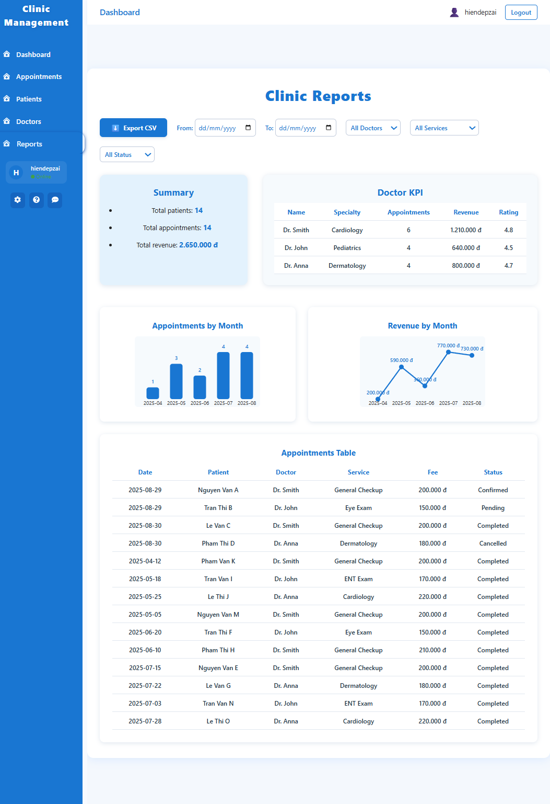  
- **Feedback** – Collect patient and doctor feedback for improvements.  
  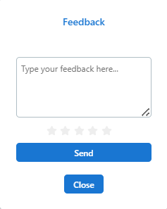  

---

## ⚙️ How to Run  

1. Clone the repository:  
   ```bash
   git clone https://github.com/your-username/Clinic-Management.git
   cd Clinic-Management
2. Start development server:
npm run dev
3. npm run build
npm run build
