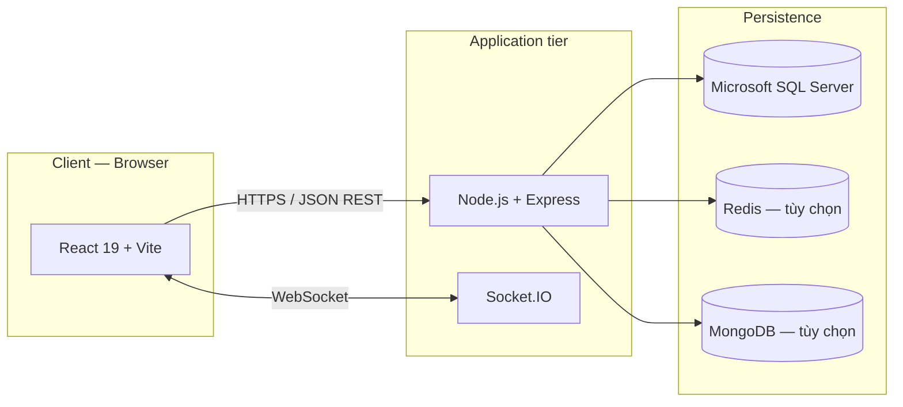

<div align="center">

# Clinic Management System  
### Hệ thống quản lý phòng khám — đồ án **Cơ sở dữ liệu nâng cao**

[](https://opensource.org/licenses/MIT)  
[](package.json)  
[](https://github.com/TheHien04/Clinic-Management/actions)

**Repository:** [github.com/TheHien04/Clinic-Management](https://github.com/TheHien04/Clinic-Management)

</div>

<p align="center">
  
</p>

Ứng dụng web full-stack quản trị **bệnh nhân, bác sĩ, lịch hẹn, hồ sơ y tế, báo cáo và tích hợp thời gian thực**, được xây dựng để minh họa **thiết kế CSDL chuẩn hóa**, **tối ưu truy vấn**, **tự động hóa bằng SP/trigger**, cùng **quy trình kỹ thuật phần mềm** (API có kiểm thử, CI/CD, Docker).

**English:** A database-centric clinic/hospital management system demonstrating advanced SQL Server design, versioned migrations, analytics artifacts, and production-oriented API practices (auth, rate limits, observability hooks, GitHub Actions).

---

## Mục lục

1. [Tổng quan & mục tiêu học thuật](#1-tổng-quan--mục-tiêu-học-thuật)  
2. [Kiến trúc & công nghệ](#2-kiến-trúc--công-nghệ)  
3. [Demo giao diện theo từng module](#3-demo-giao-diện-theo-từng-module)  
4. [Lớp dữ liệu & chuẩn CSDL nâng cao](#4-lớp-dữ-liệu--chuẩn-csdl-nâng-cao)  
5. [API, bảo mật & chất lượng kỹ thuật phần mềm](#5-api-bảo-mật--chất-lượng-kỹ-thuật-phần-mềm)  
6. [Cài đặt & vận hành](#6-cài-đặt--vận-hành)  
7. [Docker](#7-docker)  
8. [Tài liệu bổ sung](#8-tài-liệu-bổ-sung)

---

## 1. Tổng quan & mục tiêu học thuật

Dự án kết hợp:

| Hướng **CSDL nâng cao** | Hướng **kỹ sư phần mềm / dữ liệu** |
|-------------------------|-------------------------------------|
| Chuẩn hóa lược đồ, khóa & ràng buộc | Kiến trúc **client–server**, REST API rõ ràng |
| Index & kế hoạch thực thi cho báo cáo | **Migration có phiên bản**, kiểm tra checksum |
| Thủ tục lưu trữ, trigger (trong kho script) | **CI** (lint, test, build, Lighthouse, smoke + SQL Server) |
| View / analytics phục vụ báo cáo | **Docker Compose** cho tái lập môi trường |
| Phân vùng / script nâng cao (`Data/`) | **Bảo mật tầng API** (JWT, rate limit, sanitization) |

<p align="center">
  
  <br/><em>Giao diện ứng dụng trong ngữ cảnh quản trị phòng khám</em>
</p>

---

## 2. Kiến trúc & công nghệ


```mermaid
flowchart LR
  subgraph client [Client — Browser]
    FE[React 19 + Vite]
  end
  subgraph api [Application tier]
    BE[Node.js + Express]
    RT[Socket.IO]
  end
  subgraph persistence [Persistence]
    SQL[(Microsoft SQL Server)]
    RD[(Redis — tùy chọn)]
    MG[(MongoDB — tùy chọn)]
  end
  FE -->|HTTPS / JSON REST| BE
  FE <-->|WebSocket| RT
  BE --> SQL
  BE --> RD
  BE --> MG
```

| Lớp | Công nghệ |
|-----|-----------|
| **Frontend** | React 19, Vite 7, React Router 7, Ant Design, Tailwind, Recharts, Axios, Socket.IO client |
| **Backend** | Express 4, `mssql`, JWT, `express-validator`, rate limiting, Socket.IO |
| **CSDL chính** | SQL Server — script & migration trong `backend/migrations/`, thư viện bổ sung `Data/` |
| **Vận hành** | GitHub Actions (`.github/workflows/`), Docker (`docker-compose.yml`) |
| **Kiểm thử** | Vitest (FE/BE), smoke API, k6 load test (thư mục `backend/tests/loadtest/`) |

---

## 3. Demo giao diện theo từng module

### 3.1. Đăng ký / đăng nhập & phiên làm việc bảo mật

<p align="center">
  
  
</p>

**Chức năng:** đăng nhập, đăng ký, hỗ trợ luồng **MFA** khi backend yêu cầu; token **JWT** + refresh; đồng bộ **Auth context** và **Socket** sau khi đăng nhập thành công.

---

### 3.2. Dashboard — tổng quan vận hành

<p align="center">
  
  
</p>
<p align="center">
  
  
</p>

**Chức năng:** chỉ số tổng quan, tín hiệu vận hành, liên kết nhanh tới các modul; phù hợp trình diễn **OLTP + báo cáo tóm tắt** trên cùng nguồn dữ liệu chuẩn hóa.

---

### 3.3. Quản lý bệnh nhân (Patients)

<p align="center">
  
  
</p>
<p align="center">
  
  
</p>

**Chức năng:** tra cứu, thêm/sửa thông tin nhân khẩu & lý lịch bệnh án liên quan; nền tảng cho các báo cáo demography và lịch sử khám.

---

### 3.4. Quản lý bác sĩ (Doctors)

<p align="center">
  
  
</p>
<p align="center">
  
  
</p>
<p align="center">
  
</p>

**Chức năng:** hồ sơ chuyên môn, lịch làm việc, phản hồi chất lượng — gắn với **ràng buộc lịch hẹn** ở tầng dữ liệu và API.

---

### 3.5. Lịch hẹn (Appointments)

<p align="center">
  
  
</p>
<p align="center">
  
</p>

**Chức năng:** tạo/cập nhật lịch, trạng thái lịch, giảm xung đột; có thể mở rộng bằng **partition** bảng lịch (`Data/create_partition_appointments.sql`) cho khối lượng lớn.

---

### 3.6. Hồ sơ y tế (Medical Records)

<p align="center">
  
  
</p>
<p align="center">
  
  
</p>
<p align="center">
  
</p>

**Chức năng:** ghi nhận đợt khám, chỉnh sửa có kiểm soát, xem chi tiết — phù hợp trình bày **tính toàn vẹn dữ liệu** và **chuỗi thao tác lâm sàng**.

---

### 3.7. Báo cáo & phân tích (Reports / Analytics)

<p align="center">
  
  
  
</p>
<p align="center">
  
  
  
</p>
<p align="center">
  
  
  
</p>

**Chức năng:** dashboard báo cáo đa chiều (doanh thu, hoạt động, phân bổ thời gian…) — thể hiện **truy vấn tổng hợp**, **view/analytics script** và tối ưu index trong repo SQL.

---

### 3.8. Innovation Lab

<p align="center">
  
  
  
</p>

**Chức năng:** sandbox tính năng / handover vận hành — minh họa **mở rộng lược đồ** và API (`/api/innovation`) với kiểm soát quyền.

---

### 3.9. Thông báo (Notifications)

<p align="center">
  
</p>

**Chức năng:** danh sách & trạng thái thông báo; có thể kết hợp **Socket.IO** cho cập nhật thời gian thực.

---

### 3.10. Hospital Portal

<p align="center">
  
  
</p>

**Chức năng:** góc nhìn tích hợp theo bệnh viện / đơn vị — bổ trợ thuyết minh **phân quyền đa vai trò**.

---

### 3.11. Patient Portal

<p align="center">
  
  
</p>

**Chức năng:** cổng cho người bệnh theo dõi lịch & thông tin liên quan.

---

### 3.12. Trợ giúp, cài đặt & góp ý

<p align="center">
  
  
  
</p>

---

## 4. Lớp dữ liệu & chuẩn CSDL nâng cao

- **`backend/migrations/`** — áp dụng tuần tự, ghi nhận trong `dbo.SchemaMigrations` (id + checksum), phù hợp **triển khai có kiểm soát** như môi trường thực tế.  
- **`Data/`** — script **core / nâng cao**: index, view, stored procedure, trigger, audit, analytics, partition (ví dụ appointment).  
- **Tối ưu & mô hình** — thiết kế bảng fact/dimension trong báo cáo; có thể mở rộng DWH/ETL (xem mục *Future* trong tài liệu).  
- **Tính nhất quán** — ràng buộc khóa ngoại, transaction trong thủ tục; seed tài khoản demo sau migrate (chi tiết `backend/README.md`).

---

## 5. API, bảo mật & chất lượng kỹ thuật phần mềm

- **Xác thực / ủy quyền:** JWT, refresh token, middleware `authorize` theo vai trò.  
- **Hardening:** rate limit (kể cả giới hạn đặt lịch theo người dùng/IP an toàn IPv6), sanitization đầu vào, security headers, CSRF tùy chọn.  
- **Quan sát:** health check `/api/health`, middleware hiệu năng; tùy chọn **Redis** cho cache.  
- **Chất lượng:** `npm run qa:release` (lint FE, test FE, build, unit BE, _smoke_); workflow CI trên GitHub với **SQL Server service**.  
- **Báo cáo lỗ hổng:** [SECURITY.md](SECURITY.md) · [docs/SECURITY_GUIDE.md](docs/SECURITY_GUIDE.md).

---

## 6. Cài đặt & vận hành

| Dịch vụ | URL mặc định (dev) |
|--------|----------------------|
| Frontend (Vite) | http://localhost:5173 |
| Backend API | http://localhost:5055 |
| Health | http://localhost:5055/api/health |

```bash
git clone https://github.com/TheHien04/Clinic-Management.git
cd Clinic-Management
npm install

cd backend && cp .env.example .env
# Cấu hình DB_SERVER, DB_USER, DB_PASSWORD, DB_NAME, JWT_*, …
npm run db:deploy
cd ..

npm run dev:stable
```

- **Yêu cầu Node:** `>= 20 < 23` (theo `engines` trong `package.json`).  
- **Tài khoản demo** (sau seed): xem [backend/README.md](backend/README.md).

**Kiểm thử nhanh (local):**

```bash
npm run qa:release
npm run qa:security
```

---

## 7. Docker

```bash
cp .env.docker.example .env
# Chỉnh MSSQL_SA_PASSWORD, JWT_SECRET, JWT_REFRESH_SECRET
docker compose up --build
```

- **API:** http://localhost:5055  
- **Frontend (nginx):** http://localhost:8080  
- **SQL Server:** localhost:1433 · **Redis:** localhost:6379  

Entrypoint backend: `ensure-database` → migrate → `node src/server.js` (xem `backend/scripts/docker-entrypoint.sh`).

---

## 8. Tài liệu bổ sung

| Tài liệu | Mô tả |
|---------|--------|
| [docs/README.md](docs/README.md) | Cấu trúc repo, mô tả môn học (song song README gốc) |
| [backend/README.md](backend/README.md) | API, env, migrate, seed |
| [frontend/README.md](frontend/README.md) | FE, test, build |
| [docs/BACKEND_API_GUIDE.md](docs/BACKEND_API_GUIDE.md) | Hợp đồng API (nếu có trong repo) |
| [docs/DEVOPS_DOCKER_CICD.md](docs/DEVOPS_DOCKER_CICD.md) | DevOps & CI/CD |

---

## Hướng phát triển (gợi ý)

- Đa ngôn ngữ UI · Audit log chi tiết cho mọi thay đổi quan trọng · Tích hợp cloud DB (Azure SQL / RDS) · BI chuyên sâu (Power BI / semantic layer) · Pipeline ETL/DWH.

---

<div align="center">

**TheHien04** · [Clinic-Management](https://github.com/TheHien04/Clinic-Management) · Đồ án CSDL nâng cao + thực hành kỹ sư phần mềm

</div>
