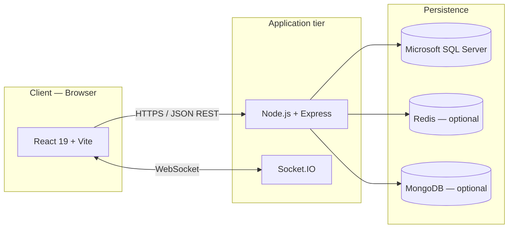
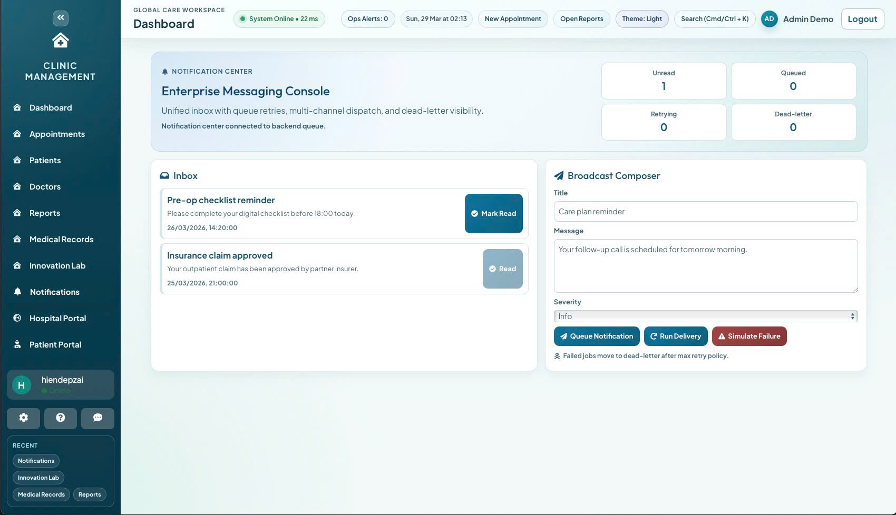
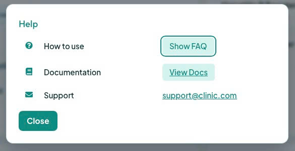
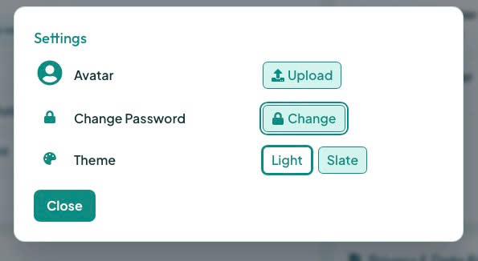
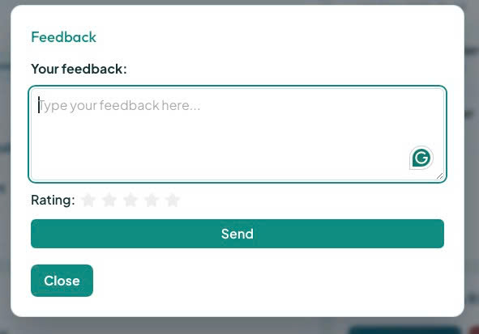

<div align="center">

# Clinic Management System  
### Advanced Database Course — Full-stack healthcare operations demo

[](https://opensource.org/licenses/MIT)  
[](package.json)  
[](https://github.com/TheHien04/Clinic-Management/actions)


</div>

<p align="center">
  
</p>

A **database-centric**, full-stack web application for managing **patients, physicians, appointments, medical records, analytics dashboards, and real-time notifications**. It showcases **normalized relational design**, **query tuning**, **stored procedures and triggers** (via the SQL script library), **versioned schema migrations**, and **software-engineering discipline**: tested APIs, CI/CD, Docker, security middleware, and observability hooks.

---

## Table of contents

1. [Project overview and learning goals](#1-project-overview-and-learning-goals)  
2. [Architecture and technology stack](#2-architecture-and-technology-stack)  
3. [UI walkthrough by module](#3-ui-walkthrough-by-module)  
4. [Data layer and advanced database topics](#4-data-layer-and-advanced-database-topics)  
5. [API, security, and software quality](#5-api-security-and-software-quality)  
6. [Local setup and operations](#6-local-setup-and-operations)  
7. [Docker](#7-docker)  
8. [Additional documentation](#8-additional-documentation)

---

## 1. Project overview and learning goals

This work combines **advanced database engineering** with **modern application delivery**:

| **Database track** | **Software / data engineering track** |
|----------------------|----------------------------------------|
| Normalized schemas, keys, and constraints | Client–server architecture and RESTful APIs |
| Indexes and execution plans for reporting | **Versioned migrations** with checksum tracking |
| Stored procedures and triggers (script library) | **CI**: lint, tests, build, Lighthouse, smoke against SQL Server |
| Views and analytics for BI-style reports | **Docker Compose** for reproducible environments |
| Partitioning and advanced scripts in `Data/` | **API hardening** (JWT, rate limiting, input sanitization) |

<p align="center">
  
  <br/><em>Application UI in a clinic administration context</em>
</p>

---

## 2. Architecture and technology stack


```mermaid
flowchart LR
  subgraph client [Client — Browser]
    FE[React 19 + Vite]
  end
  subgraph api [Application tier]
    BE[Node.js + Express]
    RT[Socket.IO]
  end
  subgraph persistence [Persistence]
    SQL[(Microsoft SQL Server)]
    RD[(Redis — optional)]
    MG[(MongoDB — optional)]
  end
  FE -->|HTTPS / JSON REST| BE
  FE <-->|WebSocket| RT
  BE --> SQL
  BE --> RD
  BE --> MG
```

| Layer | Technology |
|-------|------------|
| **Frontend** | React 19, Vite 7, React Router 7, Ant Design, Tailwind, Recharts, Axios, Socket.IO client |
| **Backend** | Express 4, `mssql`, JWT, `express-validator`, rate limiting, Socket.IO |
| **Primary database** | SQL Server — migrations in `backend/migrations/`, extended scripts in `Data/` |
| **Operations** | GitHub Actions (`.github/workflows/`), Docker (`docker-compose.yml`) |
| **Testing** | Vitest (FE/BE), API smoke tests, k6 load tests under `backend/tests/loadtest/` |

---

## 3. UI walkthrough by module

### 3.1. Sign-in, sign-up, and secure session

<p align="center">
  
  
</p>

**Capabilities:** authentication and self-service registration, optional **MFA** flow when enabled by the API, **JWT** access tokens with refresh tokens, **Auth context** hydration, and **Socket.IO** initialization after a successful login.

---

### 3.2. Dashboard — operational overview

<p align="center">
  
  
</p>
<p align="center">
  
  
</p>

**Capabilities:** KPIs, operational signals, and shortcuts into functional modules — suitable for demonstrating **OLTP plus summary reporting** over a single normalized data store.

---

### 3.3. Patient management

<p align="center">
  
  
</p>
<p align="center">
  
  
</p>

**Capabilities:** search, create, and update demographics and clinical context; foundation for cohort and visit-history analytics.

---

### 3.4. Physician (doctor) management

<p align="center">
  
  
</p>
<p align="center">
  
  
</p>
<p align="center">
  
</p>

**Capabilities:** provider profiles, schedules, and quality feedback — aligned with **scheduling constraints** enforced in the database and API layers.

---

### 3.5. Appointments

<p align="center">
  
  
</p>
<p align="center">
  
</p>

**Capabilities:** create and update appointments, track status, and reduce scheduling conflicts. High-volume deployments can leverage **table partitioning** (see `Data/create_partition_appointments.sql`).

---

### 3.6. Medical records

<p align="center">
  
  
</p>
<p align="center">
  
  
</p>
<p align="center">
  
</p>

**Capabilities:** document encounters, controlled edits, and rich detail views — illustrating **data integrity** and **clinical workflow** sequencing.

---

### 3.7. Reports and analytics

<p align="center">
  
  
  
</p>
<p align="center">
  
  
  
</p>
<p align="center">
  
  
  
</p>

**Capabilities:** multi-dimensional operational and financial dashboards backed by **aggregate queries**, **analytic views**, and index strategies maintained in the SQL repository.

---

### 3.8. Innovation Lab

<p align="center">
  
  
  
</p>

**Capabilities:** experimental features and operational handovers — demonstrates **schema extension** patterns and the `/api/innovation` surface with **role-aware** access control.

---

### 3.9. Notifications

<p align="center">
  
</p>

**Capabilities:** notification inbox and delivery status; can be combined with **Socket.IO** for live updates.

---

### 3.10. Hospital portal

<p align="center">
  
  
</p>

**Capabilities:** hospital-wide integrated experience — useful for demonstrating **multi-role authorization** narratives.

---

### 3.11. Patient portal

<p align="center">
  
  
</p>

**Capabilities:** patient-facing views for schedules and related information.

---

### 3.12. Help, settings, and feedback

<p align="center">
  
  
  
</p>

---

## 4. Data layer and advanced database topics

- **`backend/migrations/`** — ordered, idempotent deployments tracked in `dbo.SchemaMigrations` (migration id + checksum), matching **controlled release** practices.  
- **`Data/`** — supplementary SQL: indexes, views, stored procedures, triggers, auditing, analytics, and partitioning (e.g., appointments).  
- **Modeling and optimization** — fact- and dimension-oriented reporting patterns; natural path to **DWH / ETL** extensions (see roadmap notes in docs).  
- **Consistency** — foreign-key integrity and transactional stored logic where applicable; demo admin seeding after migrate (see `backend/README.md`).

---

## 5. API, security, and software quality

- **Authentication and authorization:** JWT access tokens, refresh rotation, `authorize` middleware by role.  
- **Hardening:** rate limits (including appointment-specific limits with **IPv6-safe** key generation), request sanitization, security headers, and optional CSRF controls.  
- **Observability:** `/api/health`, performance middleware; optional **Redis** for response caching.  
- **Quality gates:** `npm run qa: release` (frontend lint/tests/build, backend unit tests, smoke); GitHub Actions workflows with a **SQL Server** service container.  
- **Vulnerability reporting:** [SECURITY.md](SECURITY.md) and [docs/SECURITY_GUIDE.md](docs/SECURITY_GUIDE.md).

---

## 6. Local setup and operations

| Service | Default URL (development) |
|---------|---------------------------|
| Frontend (Vite) | http://localhost:5173 |
| Backend API | http://localhost:5055 |
| Health | http://localhost:5055/api/health |

```bash
git clone https://github.com/TheHien04/Clinic-Management.git
cd Clinic-Management
npm install

cd backend && cp .env.example .env
# Set DB_SERVER, DB_USER, DB_PASSWORD, DB_NAME, JWT_*, etc.
npm run db:deploy
cd ..

npm run dev:stable
```

- **Node.js:** `>= 20` and `< 23` per `engines` in `package.json`.  
- **Demo credentials** (after seed): see [backend/README.md](backend/README.md).

**Quick local QA:**

```bash
npm run qa: release
npm run qa: security
```

---

## 7. Docker

```bash
cp .env.docker.example .env
# Adjust MSSQL_SA_PASSWORD, JWT_SECRET, JWT_REFRESH_SECRET as needed
docker compose up --build
```

- **API:** http://localhost:5055  
- **Frontend (nginx):** http://localhost:8080  
- **SQL Server:** localhost:1433  
- **Redis:** localhost:6379  

Backend container entrypoint: `ensure-database` → `migrate` → `node src/server.js` (see `backend/scripts/docker-entrypoint.sh`).

---

## 8. Additional documentation

| Document | Description |
|----------|-------------|
| [docs/README.md](docs/README.md) | Documentation index and repository map |
| [backend/README.md](backend/README.md) | API, environment variables, migrations, seed data |
| [frontend/README.md](frontend/README.md) | Frontend scripts, testing, production build |
| [docs/BACKEND_API_GUIDE.md](docs/BACKEND_API_GUIDE.md) | API contract and usage |
| [docs/DEVOPS_DOCKER_CICD.md](docs/DEVOPS_DOCKER_CICD.md) | DevOps and CI/CD notes |

---

## Roadmap ideas

- Internationalization (i18n) · Expanded audit logging for sensitive mutations · Managed cloud SQL (Azure SQL / RDS) · Deeper BI integration (Power BI, semantic models) · ETL / data warehouse pipelines.

---

<div align="center">

**TheHien04** · [Clinic-Management](https://github.com/TheHien04/Clinic-Management) · Advanced databases + professional software engineering practice

</div>
